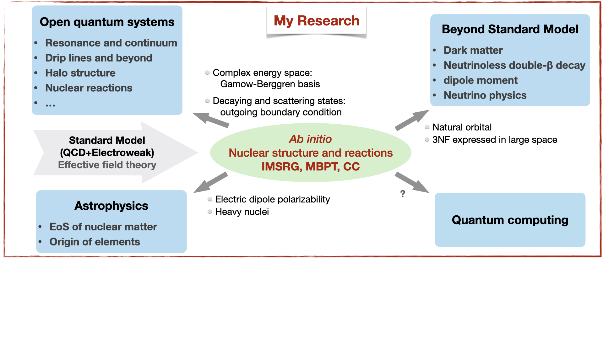

## Bio

I am a postdoctoral fellow at TRIUMF. My research is focused on *ab initio* calculations of nuclear structure. Starting from two- (NN) and three-nucleon (3N) forces, derived within chiral effective field theory, and consistent electroweak currents, I mainly use in-medium similarity renormalization group (IMSRG) and many-body perturbation theory (MBPT) to solve the many-body Schrödinger equation.

## Interests

My research interests cover *ab initio* calculations of nuclear structure and reactions,
as well as related topics such as dark matter, neutrino physics, fundamental
symmetries and nuclear astrophysics.

