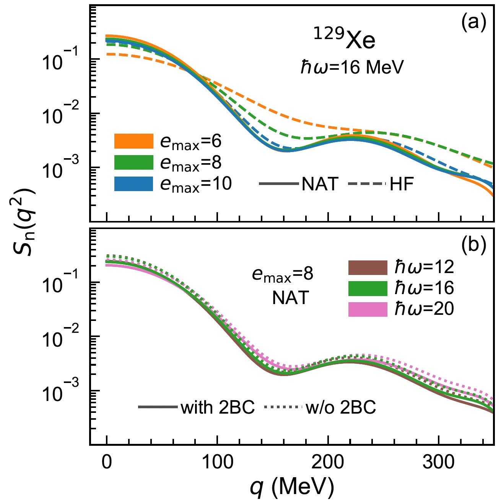
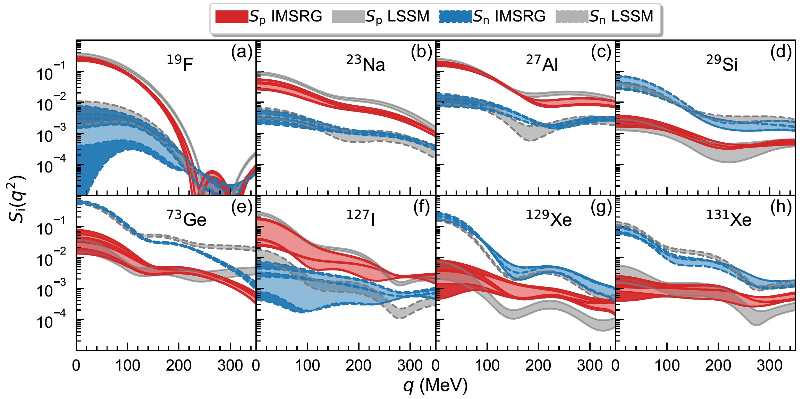
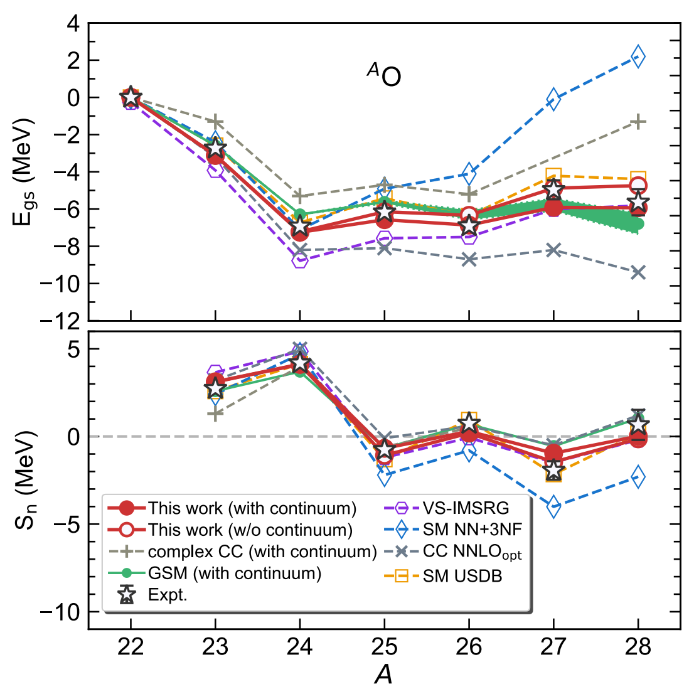
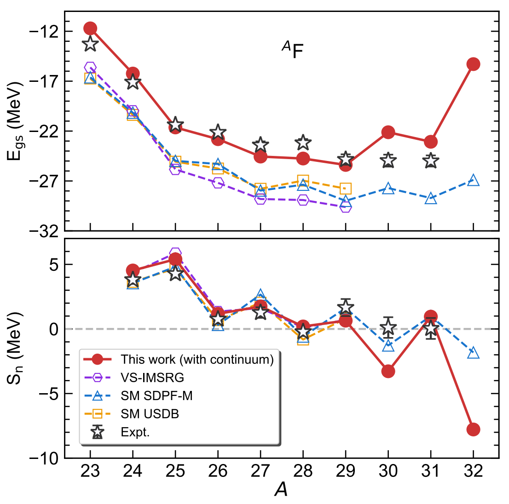
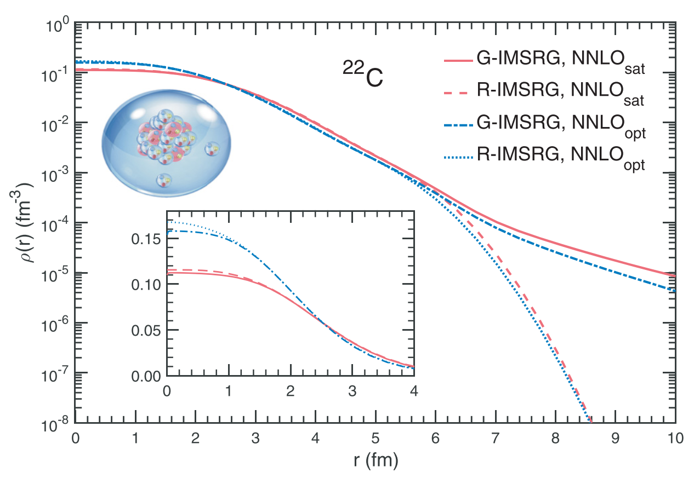
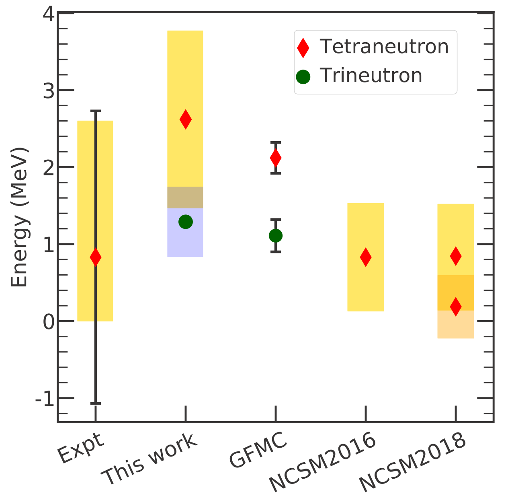



# Selected Works

##  Beyond Standard Model

- ### *Ab initio* structure factors for spin-dependent dark matter direct detection  

**B. S. Hu**, J. Padua-Argüelles, S. Leutheusser, T. Miyagi, S. R. Stroberg and J. D. Holt, submitted. arXiv:2109.00193v1 (2021). [arxiv](https://arxiv.org/abs/2109.00193)      
&nbsp;   
We present converged *ab initio* calculations of structure factors for elastic spin-dependent WIMP scattering off all nuclei used in dark matter direct-detection searches:$^{19}$F, $^{23}$Na, $^{27}$Al, $^{29}$Si, $^{73}$Ge, $^{127}$I, and $^{129,131}$Xe. From a set of established chiral NN+3N interactions, 1.8/2.0(EM), N$^4$LO+3Nlnl and $\Delta$NNLO$_{\text{GO}}$, we construct consistent WIMP-nucleon currents at the one-body level, including effects from axial-vector two-body currents. We then apply the IMSRG to construct effective valence-space Hamiltonians and consistently transformed operators of nuclear responses.  Combining the recent advances of natural orbitals with three-nucleon forces expressed in large spaces, we obtain basis-space converged structure factors even in heavy nuclei. We find our results of structure factor are consistent with phenomenological calculations, but in certain cases can differ by as much as $80-90\%$ at low momentum transfer.

##  Open Quantum Systems

- ### An *ab-initio* Gamow shell model approach with a core  

**B.S. Hu**, Q. Wu, J.G. Li, Y.Z. Ma, Z.H. Sun, N. Michel and F.R. Xu, Phys. Lett. B 802 (2020) 135206. arXiv:2001.02832 (2020). [article](https://doi.org/10.1016/j.physletb.2020.135206) [arxiv](https://arxiv.org/abs/2001.02832)     
&nbsp;   
Gamow shell model (GSM) is usually performed within the Woods-Saxon (WS) basis in which the WS parameters need to be determined by fitting experimental single-particle energies including their resonance widths. In the multi-shell case, such a fit is difficult due to the lack of experimental data of cross-shell single-particle energies and widths. In this work, we develop an *ab-initio* GSM by introducing the Gamow Hartree-Fock (GHF) basis that is obtained using the same interaction as the one used in the construction of the shell-model Hamiltonian. GSM makes use of the complex-momentum Berggren representation, then including resonance and continuum components. Hence, GSM gives a good description of weakly bound and unbound nuclei.  Starting from chiral effective field theory and employing many-body perturbation theory (MBPT) (called nondegenerate $\hat Q$-box folded-diagram renormalization) in the GHF basis, a multi-shell Hamiltonian (*sd-pf* shells in this work) can be constructed. The single-particle energies and their resonance widths can also been obtained using MBPT. We investigated $^{23-28}$O and $^{23-31}$F isotopes, for which multi-shell calculations are necessary. Calculations show that continuum effects and the inclusion of the *pf* shell are important elements to understand the structure of nuclei close to and beyond drip lines.

- ### *Ab initio* Gamow in-medium similarity renormalization group with resonance and continuum

**B. S. Hu**, Q. Wu, Z. H. Sun and F. R. Xu, Phys Rev C 99 (2019) 061302(R). arXiv:1906.10539 (2019). [article](https://journals.aps.org/prc/abstract/10.1103/PhysRevC.99.061302) [arxiv](https://arxiv.org/abs/1906.10539)    
&nbsp;   
We have developed a novel *ab initio* Gamow in-medium similarity renormalization group (Gamow IMSRG) in the complex-energy Berggren framework. The advanced Gamow IMSRG is capable of describing the resonance and nonresonant continuum properties of weakly-bound and unbound nuclear many-body systems. As test grounds, carbon and oxygen isotopes have been calculated with chiral two- and three-nucleon forces from the effective field theory. The halo structure of the known heaviest Borromean nucleus $^{22}$C is clearly seen by calculating the density distribution, in which continuum $s$-channel plays a crucial role. Further, we predict low-lying resonant excited states in $^{22}$C. The Gamow IMSRG provides tractable *ab initio* calculations of weakly-bound and unbound open quantum systems.

- ### *Ab initio* no-core Gamow shell-model calculations of multi-neutron systems

J. G. Li, N. Michel, **B. S. Hu**, W. Zuo and F. R. Xu, Phys Rev C 100 (2019) 054313. arXiv:1911.06485 (2019). [article](https://journals.aps.org/prc/abstract/10.1103/PhysRevC.100.054313)  [arxiv](https://arxiv.org/abs/1911.06485)      
&nbsp;   
The existence of multi-neutron systems has always been a debatable question. Indeed, both internucleon correlations and a large continuum coupling occur in these states. We then employ the *ab initio* no-core Gamow shell model to calculate the resonant energies and widths of the trineutron and tetraneutron systems with realistic interactions. Our results indicate that trineutron and tetraneutron are both unbound and bear broad widths. The calculated energy and width of tetraneutron are also comparable with recent experimental data. Moreover, our calculations suggest that the energy of trineutron is lower than that of tetraneutron, while its resonance width is also narrower. This strongly suggests that trineutron is more likely to be experimentally observed than tetraneutron. We thus suggest experimentalists to search for trineutron at low energy.

